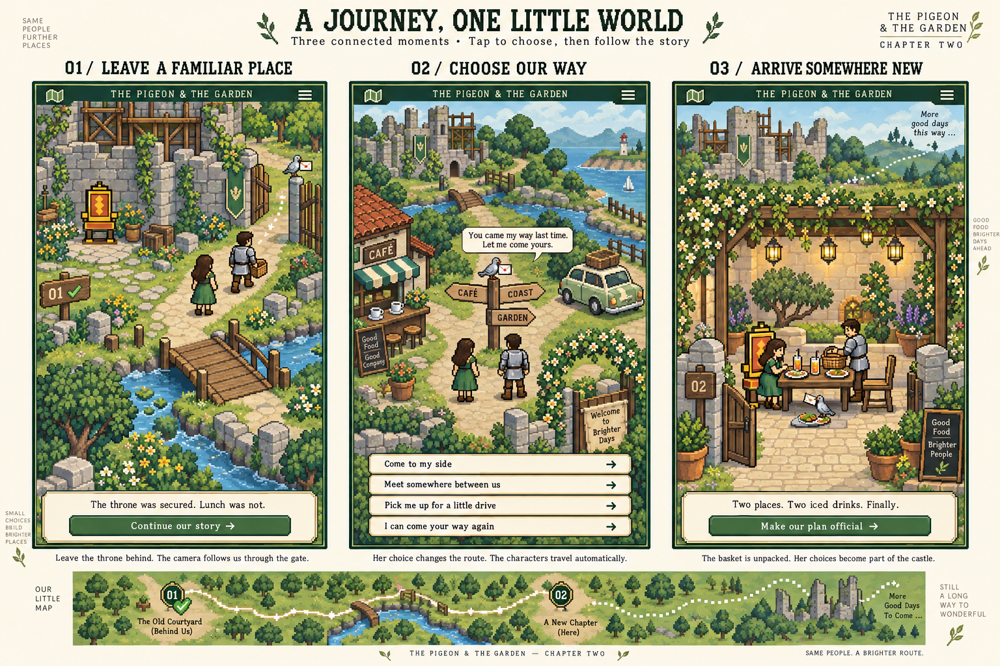

# A journey, one little world

Concept storyboard for review, 9 September 2026. This is a design artifact, not an implementation change.

Generated with the built-in image-generation tool. The existing gold-throne sprite was supplied as an object reference. Prompt brief: three portrait views on one landscape storyboard board, simple economical 16-bit garden palette, consistent green-dressed heroine and aspiring knight, overhead connected geography; leave the original castle grounds, choose travel at a village crossroads, arrive at the dining courtyard with food and two iced drinks; annotate camera travel and include a connecting map strip. Preserve the existing throne; keep the completed castle and dragon for later chapters.

## Self-review of the generated board

The three places now have distinct silhouettes, the stream and unfinished castle establish continuity, and the basket supplies a visible beginning-to-end story. The spatial direction is substantially clearer than the repeated platform composition. Before implementation, simplify the dense foliage and decorative signs to stay closer to the original game's restraint; increase the travel choices to comfortable thumb targets. Treat incidental generated signage and extra tiny decorative text as non-final. This board is for composition approval, not a pixel-exact UI specification.

## The visual rule

Keep the original pixel charm and readable, economical palette. Move to a gentle overhead view so paths can bend through a connected world. The recipient chooses what sounds nice; the characters and camera handle travel. A persistent stream, gate, path and distant unfinished castle establish that each view is further along the same route.

The three hero frames demonstrate the spatial idea, not the complete screen count. The village food decision and timing stop happen between the crossroads and arrival.

## Frame 01 — Leave a familiar place

**Recognition:** completed Stop 01 marker, her chosen throne, unfinished castle and scaffold. An empty basket recalls the unfinished meal without repeating the introduction, throne selection or first-date questionnaire.

**Dialogue:** “The throne was secured. Lunch was not.”

**Action:** Continue our story.

**Movement:** the knight picks up the empty basket, the pigeon hops toward the open gate, and the pair walk across a visible bridge. The camera follows toward the gate already shown on screen. Stop 01 visibly recedes.

## Frame 02 — Choose our way

**Recognition:** a new village crossroads with a café, signpost, parked car and scenic route. The same stream and the old gate remain visible behind the characters.

**Dialogue:** “You came my way last time. Let me come yours.”

**Choices:** Come to my side; meet somewhere between us; pick me up for a little drive; I can come your way again. Practical copy identifies Waiuku and offers a travel-distance follow-up where relevant. The illustrated map is a fictional garden, not a geographically accurate travel map.

**Movement:** the chosen branch becomes the obvious route. The knight comes toward her for the nearby plan, or they set off together for the drive. Show departure, a short stretch of travel, and arrival. Avoid repeated walking-in-place or resetting both sprites to an identical stage.

**Between frames:** choose meal, scenic drive and food, picnic, cosy table and dessert, or “plan it for me.” Food and both iced drinks visibly enter the basket. At a quiet lookout choose day and time; lighting responds. These practical decisions remain clearly labelled and keyboard accessible.

## Frame 03 — Arrive somewhere new

**Recognition:** the route enters a stone dining courtyard, visibly different from the grassy village crossroads. The table has two places, food and two iced drinks. Her remembered throne is one seat. The courtyard addition reflects her choice of fountain, flower arch or lantern tree.

**Dialogue:** “Two places. Two iced drinks. Finally.”

**Action:** Make our plan official.

**Movement:** gate opens, knight sets down the full basket, the chosen addition appears and the pigeon inspects the table. Then a compact editable decree confirms the real plan. The actual venue and hour remain to arrange by text.

**Closing camera:** gently pull back to show Stop 01, the route travelled, Stop 02 and a dotted road continuing into unexplored land. The completed castle, her final throne scene, his full knighthood and the dragon boss belong to later chapters.

## Evaluation before implementation

- Each location must be distinguishable with its text hidden.
- A landmark persists across neighbouring views to establish continuity.
- The next destination appears before the camera travels toward it.
- Choices alter an object, route or destination, not only the final summary.
- The world occupies most of the phone. Dialogue stays brief and contextual.
- Travel is short and skippable; there are no steering controls, dexterity tests or navigation puzzles.
- Maintain one consistent sprite scale and art style. Avoid the rejected painterly backdrops, oversized serif headings and permanently dominant dialogue panels.
- Motion-reduced presentation must still communicate departure, destination and progress clearly.

The generated board is a composition and movement reference. Its text and every UI control will need semantic implementation if this direction is approved; it is not an image to place over the app.
